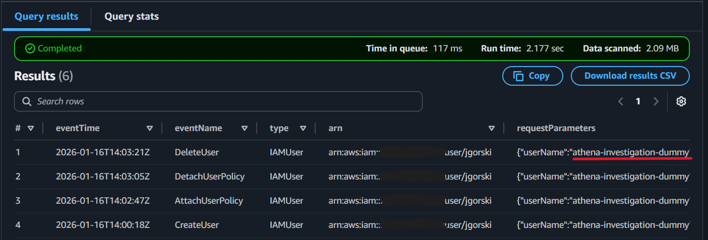
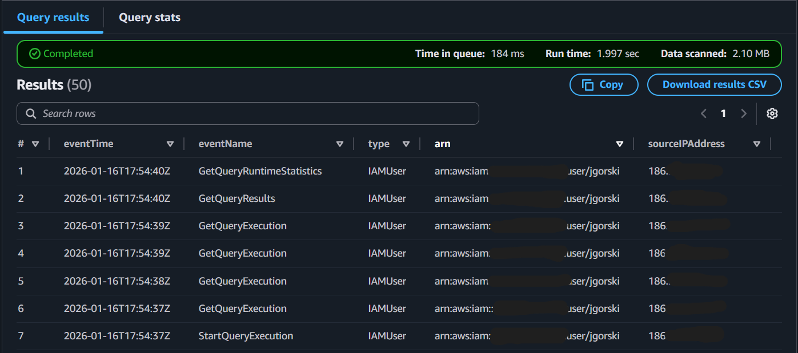
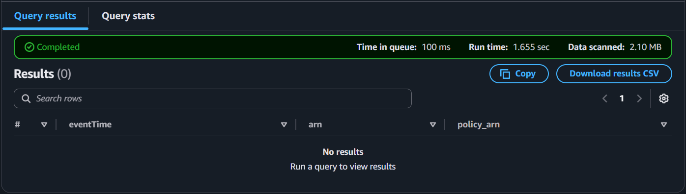
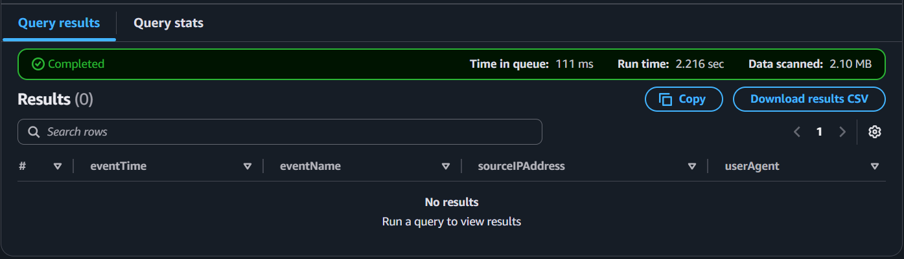
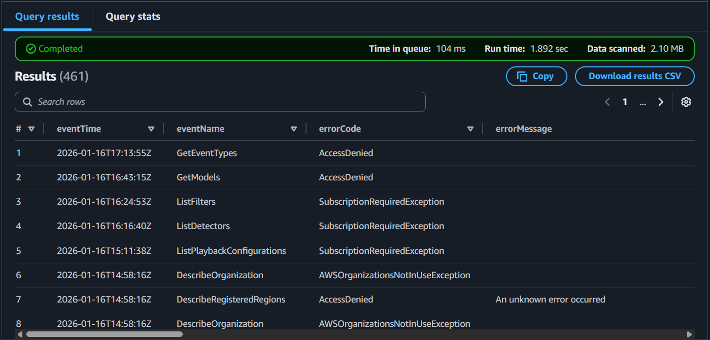

# IAM Activity Investigation Using AWS CloudTrail and Athena

**Scope:**  
This investigation analyzes AWS IAM activity using CloudTrail logs queried via Amazon Athena. 

The objective is to detect and validate identity lifecycle events, policy changes, and potential security-relevant behavior.

## Data Source

- AWS CloudTrail (Management Events)
- Logs stored in secured Amazon S3 Bucket
- Queries using Amazon Athena (Queries can be found in ```athena-queries.sql```)

## Simulated Tests

For this investigation, I simulated IAM activity via the AWS CLI. The following commands were used in succession:

```bash
aws iam create-user --user-name athena-investigation-dummy
aws iam attach-user-policy --user-name athena-investigation-dummy --policy-arn arn:aws:iam::aws:policy/ReadOnlyAccess
aws iam detach-user-policy --user-name athena-investigation-dummy --policy-arn arn:aws:iam::aws:policy/ReadOnlyAccess
aws iam delete-user --user-name athena-investigation-dummy
```

The goal was to generate IAM logs with CloudTrail that could later on be detected via Athena.

## IAM Lifecycle Activity

**Purpose:**  
Detect creation and deletion of IAM users and roles. As well as identify privilege changes via managed or inline policy attachments.

**Query:**  
```sql
SELECT
  eventTime,
  eventName,
  userIdentity.type,
  userIdentity.arn,
  requestParameters
FROM cloudtrail_logs.cloudtrail_events
WHERE eventSource = 'iam.amazonaws.com'
  AND eventName IN (
    'CreateUser', 'DeleteUser',
    'CreateRole', 'DeleteRole',
    'AttachUserPolicy', 'DetachUserPolicy',
    'AttachRolePolicy', 'DetachRolePolicy',
    'PutUserPolicy', 'DeleteUserPolicy',
    'PutRolePolicy', 'DeleteRolePolicy'
  )
ORDER BY eventTime DESC;
```
**Output:**

<p align="center">
  
</p>

**Findings:**

- Successfully detected the creation and deletion of user **athena-investigation-dummy**
- Successfully detected the policy attachment and detachment to user **athena-investigation-dummy**
- Events include timestamp, initiating identity, and request parameters.
- No unauthorized or unexpected privilege escalation behavior was identified during testing.
---

## Console vs API Usage

**Purpose:**  
Detect and compare API and Console usage on the AWS account.

**Query:**
```sql
SELECT
  eventTime,
  eventName,
  userIdentity.type,
  userIdentity.arn,
  sourceIPAddress,
  userAgent
FROM cloudtrail_logs.cloudtrail_events
WHERE userIdentity.type IN ('IAMUser', 'AssumedRole')
ORDER BY eventTime DESC
LIMIT 50;
```

**Output:**

<p align="center">
  
</p>

**Findings:**  
- Mostly IAMUser activity detected, which is the expected outcome.
---

## Privilege Escalation Indicators

**Purpose:**  
Detect actions that could indicate privilege escalation.

**Query:**
```sql
SELECT
  eventName,
  eventTime,
  userIdentity.arn,
  json_extract_scalar(requestParameters, '$.policyArn') AS policy_arn
FROM cloudtrail_logs.cloudtrail_events
WHERE eventSource = 'iam.amazonaws.com'
  AND eventName IN ('AttachUserPolicy', 'AttachRolePolicy')
  AND json_extract_scalar(requestParameters, '$.policyArn') LIKE '%AdministratorAccess%'
ORDER BY eventTime DESC;
```

**Output:**

<p align="center">
  
</p>

**Findings:**  
- No privilege escalation indicators were observed during the investigation window.
---

## Root Account Activity

**Purpose:**  
Detect usage of the AWS root account.

**Query:**
```sql
SELECT
  eventTime,
  eventName,
  sourceIPAddress,
  userAgent
FROM cloudtrail_logs.cloudtrail_events
WHERE userIdentity.type = 'Root'
ORDER BY eventTime DESC;
```

**Output:**

<p align="center">
  
</p>

**Findings:**  
- No root account activity was detected.
---

## Failed or Denied Actions

**Purpose:**  
Detect suspicious denied actions on the AWS account.

**Query:**
```sql
SELECT
  eventTime,
  eventName,
  errorCode,
  errorMessage,
  userIdentity.arn
FROM cloudtrail_logs.cloudtrail_events
WHERE errorCode IS NOT NULL
ORDER BY eventTime DESC;
```

**Output:**

<p align="center">
  
</p>

**Findings:**  
- Nothing out of the ordinary was detected during the investigation.
---

## Conclusion

This investigation confirms that AWS CloudTrail logs, when queried through Amazon Athena, provide reliable visibility into IAM lifecycle and privilege-related events.  

The detection queries validated expected behavior and established a foundation for continuous monitoring and alerting.