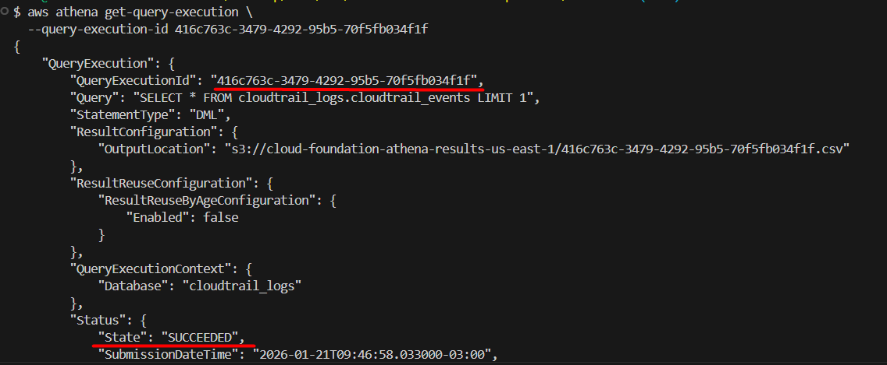
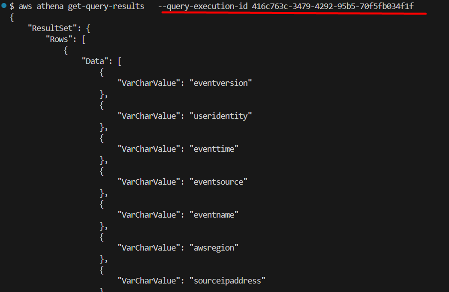
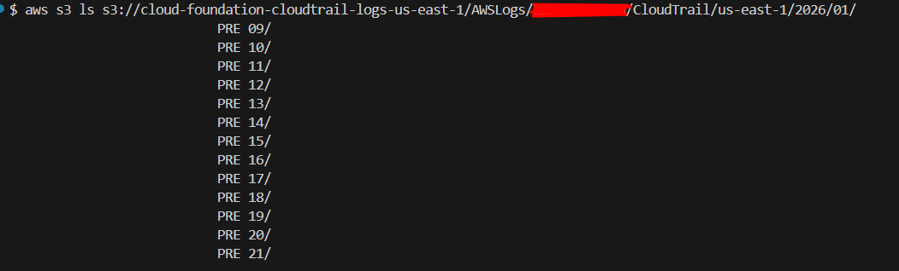
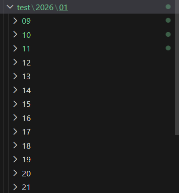
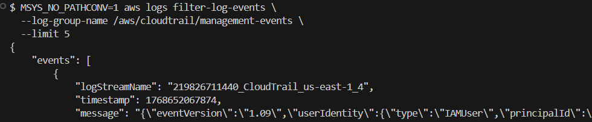

# Security Operator Role – Validation & Access Testing

## Overview

As part of this project, a dedicated **Security Operator (read-only)** IAM role was created to support security investigations without granting administrative privileges.

This document validates that the role:

- Can read and investigate CloudTrail data via Athena, S3, and CloudWatch Logs
- Cannot modify or disrupt logging, IAM, or audit-critical resources
- Adheres to least privilege principles

All tests were performed using the AWS CLI after assuming the role via STS.

---
## Index

- [Role Creation](#role)
- [Athena Access Validation](#athena)
- [CloudTrail Log Access Validation](#cloudtrail)
- [CloudWatch Log Access Validation](#cloudwatch)
- [Negative Tests (Expected Failure)](#negative)
- [Summary & Conclusion](#summary)
---
<a name="role"></a>
## Role Creation

**Role Name:** SecurityOperatorReadOnlyRole  
**Provisioned via:** Terraform (iam.tf)  
**Access Model:** AssumeRole (STS)

**Intended Use Case:**  
Security investigations, incident response, audit review  
*(No write, delete, or configuration privileges)*

---

## Assuming the Role

The role was assumed using the AWS CLI:

```bash
aws sts assume-role \
--role-arn arn:aws:iam::<ACCOUNT_ID>:role/SecurityOperatorReadOnlyRole \
--role-session-name security-operator-test
```

Temporary credentials were exported and used for all subsequent tests.

---
<a name="athena"></a>
## Athena Access Validation

### Listing Databases

```bash
aws athena list-databases --catalog-name AwsDataCatalog
```

**Result:**
```json
{
  DatabaseList: [
    { Name: cloudtrail_logs },
    { Name: default }
  ]
}
```

✅ Confirms read access to Athena metadata.

---

### Executing Queries

Initial attempt to run a query resulted in a permission error:

```bash
aws athena start-query-execution \
--query-string SELECT * FROM cloudtrail_logs.cloudtrail_events LIMIT 1 \
--query-execution-context Database=cloudtrail_logs \
--result-configuration OutputLocation=s3://cloud-foundation-athena-results-us-east-1/
```

**Error:**
```lua
InvalidRequestException: Unable to verify/create output bucket
```
---

### Resolution

The role policy document was updated to allow missing S3 permissions scoped exclusively to the Athena results bucket:

- `s3:GetBucketLocation`
- `s3:ListBucket`
- `s3:PutObject` (Exception 'Write' permission to generate Athena results)

After the update, the query executed successfully:
```json
{
  QueryExecutionId: 416c763c-3479-4292-95b5-70f5fb034f1f
}
```
<p align="center">
  
</p>

---

### Retrieving Query Results

An additional permission was required to fetch query output:

- `s3:GetObject` on `cloud-foundation-athena-results-us-east-1`

```bash
aws athena get-query-results \
--query-execution-id 416c763c-3479-4292-95b5-70f5fb034f1f
```

✅ Query results retrieved successfully  

<p align="center">
  
</p>

---
<a name="cloudtrail"></a>
## CloudTrail Log Access Validation (S3)

### Listing Logs
```bash
aws s3 ls s3://cloud-foundation-cloudtrail-logs-us-east-1/AWSLogs/<ACCOUNT_ID>/CloudTrail/us-east-1/2026/01/
```

✅ CloudTrail log files listed successfully.

<p align="center">
  
</p>

---

### Downloading Logs
```bash
aws s3 cp s3://cloud-foundation-cloudtrail-logs-us-east-1/AWSLogs/<ACCOUNT_ID>/CloudTrail/us-east-1/ ./test --recursive
```

✅ Logs copied locally for offline analysis  

<p align="center">
  
</p>

---
<a name="cloudwatch"></a>
## CloudWatch Logs Access Validation

### Listing Log Groups

```bash
aws logs describe-log-groups
```

**Result included:**

```json
{
    "logGroups": [
        {
            "logGroupName": "/aws/cloudtrail/management-events",
            "creationTime": 1768651689166,
            "retentionInDays": 90,
            "metricFilterCount": 3,
            "arn": "arn:aws:logs:us-east-1:<ACCOUNT_ID>:log-group:/aws/cloudtrail/management-events:*",
            "storedBytes": 1095421,
            "logGroupClass": "STANDARD",
            "logGroupArn": "arn:aws:logs:us-east-1:<ACCOUNT_ID>:log-group:/aws/cloudtrail/management-events",
            "deletionProtectionEnabled": false
        }
    ]
}
```
- **Main Log Group Name used:** `"/aws/cloudtrail/management-events"`

✅ Confirms read access to CloudWatch Logs.

---

### Filtering Log Events

Due to Git Bash path rewriting, the following command initially failed.

**Working command:**
```bash
MSYS_NO_PATHCONV=1 aws logs filter-log-events \
--log-group-name /aws/cloudtrail/management-events \
--limit 5
```

- The **MSYS_NO_PATHCONV=1** flag was required to prevent Git Bash from interpreting the log group name as a Windows filesystem path.

✅ Log events successfully retrieved after fix.

<p align="center">
  
</p>

---
<a name="negative"></a>
## Negative Tests (Expected Failures)

The following tests were intentionally performed to validate least privilege enforcement.

### Attempting to Delete CloudTrail Logs (S3)
```bash
aws s3 rm s3://cloud-foundation-cloudtrail-logs-us-east-1/...
```

**Result:**
```lua
AccessDenied: not authorized to perform s3:DeleteObject
```

✅ Expected behavior.

---

### Attempting to Stop CloudTrail Logging
```bash
aws cloudtrail stop-logging --name cloud-foundation-account-trail
```
**Result:**
```lua
AccessDeniedException: not authorized to perform cloudtrail:StopLogging
```
✅ Expected behavior.

---

### Attempting IAM Modification
```bash
aws iam create-user --user-name test-user
```
**Result:**
```lua
AccessDenied: not authorized to perform iam:CreateUser
```
✅ Expected behavior.

---
<a name="summary"></a>
## Summary & Conclusion

The **SecurityOperatorReadOnlyRole** successfully demonstrates:

✅ Read-only access to:
- CloudTrail logs (S3)
- Athena queries and results
- CloudWatch Logs

❌ No ability to:
- Modify IAM
- Disable logging
- Delete audit data

This confirms that the role is suitable for real-world security investigations while preserving the integrity of audit and monitoring infrastructure.
